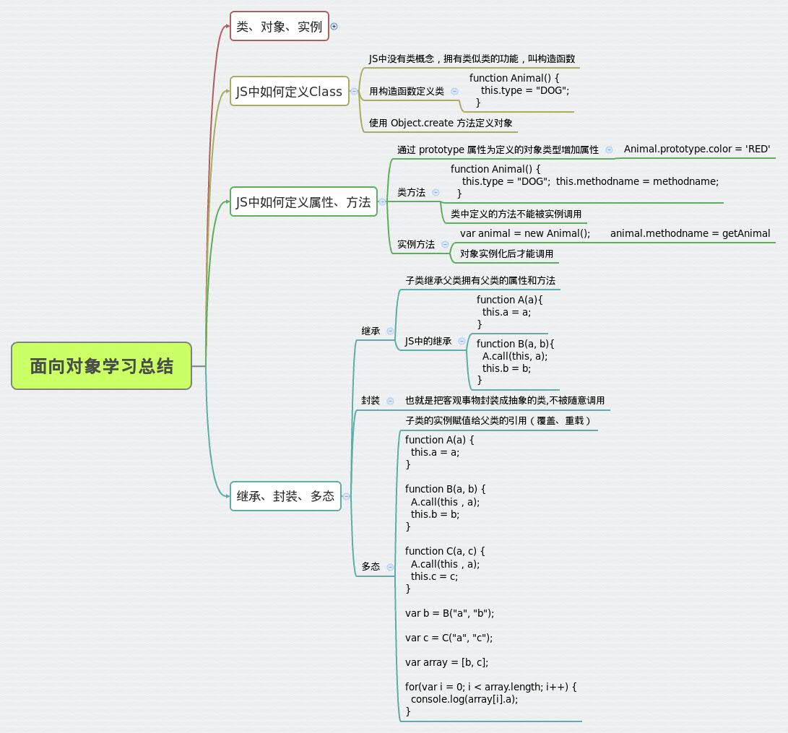

#面向对象总结
##一、类、对象、实例
###1、类
类是具有相同属性和行为的一组对象的集合。
###2、对象
对象符合某一类的标准。我们把符合某一类标准的事物称为一个对象。
###3、实例
符合某一类标准的具体的一个对象。
###4、对三者关系的理解
类是抽象的概念模型，而对象是具体的实例模型。类对象的实例化就是类的实例。
类没有值和数量，对象有值和数量，实例有值没有数量。举例说明一下它们的关系：人是一个
类，学生是‘人’类的一个对象，名为XX的学生是对象的一个实例。
##二、JavaScript如何定义一个类

JavaScript中没有‘类’的概念，它拥有类似与类功能相似的“构造函数”。
JavaScript定义‘类’类似定义一个函数。例如：

``` javascript
function Person(name, age) {
  this.name = name;
  this.age = age;
}
```
或用以下方式：
```javascript
var Person = function(name, age) {
  this.name = name;
  this.age= age;
}
```
以上就是定义了类名为Person的类，其中name和age为它的属性。

##三、JavaScript如何定义属性和方法
###1、定义属性
在JavaScript中可以通过 prototype增加属性：

  属性为定义的对象类型增加属性。

例如我们为以上定义的类增加一个sex属性，有以下几种方式：

``` javascript
function Person(name, age， sex) {
  this.name = name;
  this.age = age;
  this.sex = sex;
}
```
或用prototype增加属性：

``` javascript
function Person(name, age) {
  this.name = name;
  this.age = age;
}
```

```javascript
var Person = function(name, age) {
  this.name = name;
  this.age= age;
}
Person.prototype.sex = sex;

```
###2、定义方法
JavaScript中定义方法有两种情况：一种是定义类方法，一种是定义实例方法。
####2.1定义类方法
定义类方法是给类定义方法，不能用其实例调用。

给以上定义的类增加一个类方法：
```javascript
var Person = function(name, age) {
  this.name = name;
  this.age= age;
}
Person.prototype.workStatus = function() {
  alert("I am working now!");
};
```
####2.2定义实例方法
定义实例方法是给类实例化后的对象定义方法。该对象方法在对象实例化后才能调用。

给以上定义的类增加一个类方法：
```javascript
var Person = function(name, age) {
  this.name = name;
  this.age= age;
}
var person = new Person('Tom', 22);
person.prototype.workStatus = function() {
  alert("I am working now!");
}
```
##四、封装、继承、多态
###1、面向对象中的封装、继承、多态
####1.1封装
在面向对象编程中，封装的过程就是隐藏属性，方法和方法实现细节的过程。
一个类的属性和方法并不是完全对外公开的，只有很少一部分是公开的。
倘若你的类实现的某一个方法的细节不能被本类以外的类看到，
则就要对这个方法的实现细节进行封装。
####1.2继承
在现有一个类的基础上在定义一个类，原来的类称为父类，新定义的类称为子类。
这种父子类的关系就叫做继承，即子类继承父类。子类继承父类，就继承了父类
的属性和方法，子类也可以有自己的属性和方法。一个父类可以有多个子类。
####1.3多态
多态的抽象概念如下：父类的引用指向子类的实例。

多态是指由继承而产生的相关的不同的类，其对象对同一消息会做出不同的响应。

多态，按字面意思就是多种形态。同一操作作用于不同的对象，可以有不同的解释，产生不同的执行结果。
多态允许方法重名，参数可以是父类的参数传入，返回也可以是父类的返回。

###2、举例说明JavaScript中封装、继承、多态的实现
####2.1封装
```javascript
       function A(){
            this.show = function(){
                 alert("A show");
            };
            this.init = function(){
                 alert("A init");
            };
       }
```
这里用到了this来声明，而不是var，this是用来定义私有方法的。
####2.2继承
```javascript
function A(a){
  this.a = a;
}
function B(a, b){
  A.call(this, a);
  this.b = b;
}
```
定义一个类A，再定义一个类B继承于类A，类B拥有类A的属性。
####2.3多态
```javascript
function A(a) {
  this.a = a;
}

function B(a, b) {
  A.call(this，a);
  this.b = b;
}

function C(a, c) {
  A.call(this，a);
  this.c = c;
}

var b = B("a", "b");

var c = C("a", "c");

var array = [b, c];

for(var i = 0; i < array.length; i++) {
  console.log(array[i].a);
}
```


